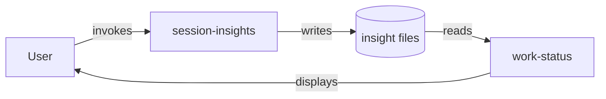
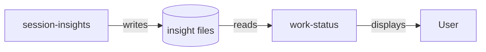
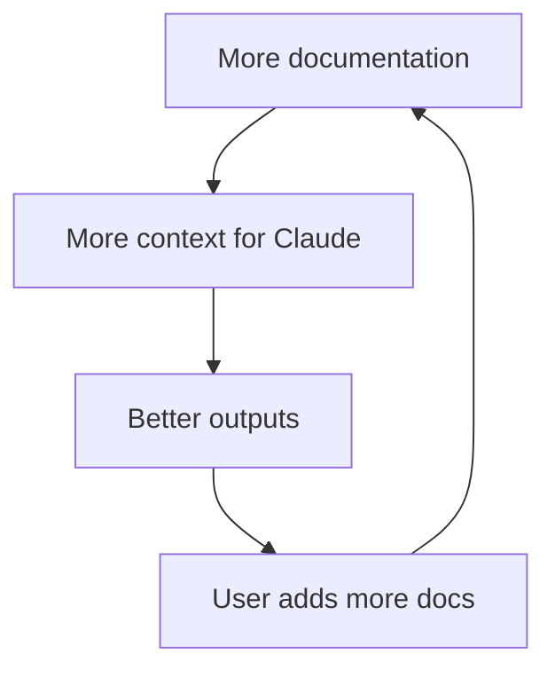
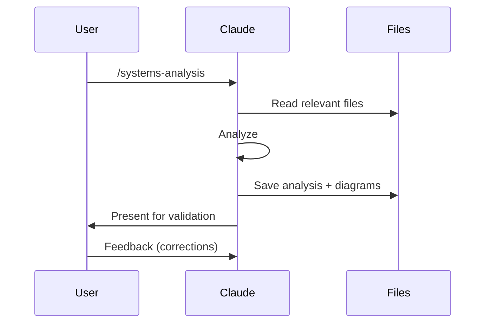

# Systems Analysis Examples

## Example: Minimal Analysis

For a simple two-component system:

```markdown
## Systems Analysis: Session Insights → Work Status

### 1. System Boundary
- **In scope:** session-insights capture, work-status display
- **Out of scope:** User decision to invoke, Claude's behavior after reading
- **Boundary crossings:** User invokes /session-insights (input), User sees orientation (output)

### 2. Components
| Component | Role | State? |
|-----------|------|--------|
| /session-insights command | Creates insight files | Stateless |
| insight files | Store captured insights | STATE |
| /work-status skill | Reads and displays insights | Stateless |

### 3. Data Flow
User invokes → session-insights → writes → insight files → reads → work-status → displays

### 4. Failure Modes
| If This Fails | Consequence | Fallback |
|---------------|-------------|----------|
| session-insights not invoked | No insights captured | Check git for session activity |
| Insight file malformed | work-status can't parse | Show "unparseable" warning |
| work-status time window wrong | Old insights hidden | User adjusts window |

### 5. Feedback Loops
- **None identified** - This is a one-way flow, no feedback from work-status to session-insights

### 6. Leverage Points
| Level | Intervention | Impact |
|-------|-------------|--------|
| Current | Fix time window parameter | Low (parameter) |
| Higher | Auto-capture insights during session-sync | High (rule change) |

### 7. Boundary Assumptions
- User remembers to invoke /session-insights ← fragile, often forgotten

### 8. Recommendation
**Proposed change:** Integrate insight prompting into session-sync
**Affects:** session-sync command, removes dependency on manual invocation
**Expected behavior change:** Insights captured more consistently
**Watch for:** session-sync becoming too long/complex

### 10. Diagrams



**Validation question:** Does this match your understanding of how insights flow from capture to display?
```

---

## Example: Workflow Critique

User proposes: "Before every commit, I want to run tests, then lint, then build, then run tests again to make sure the build didn't break anything."

```markdown
## Systems Analysis: Pre-Commit Validation Workflow

### 1-8. [Standard systems analysis sections...]

### 9. Workflow/Process Critique

| Evaluation Criterion | Assessment |
|---------------------|------------|
| **Stakeholders & Expectations** | **Developer** (actor): wants fast feedback, minimal friction. **Reviewer/Team**: wants confidence in commit quality. **CI system** (downstream): expects pre-validated code. Expectations mostly aligned - all want quality - but developer may resist slow steps that others value. |
| **Goal-Process Alignment** | Partially. Goal is "ensure commit quality" but running tests twice suggests unclear confidence in test isolation. |
| **Step Necessity** | **Redundant step identified:** Running tests after build is unnecessary if tests already passed and build doesn't modify source. Tests don't test the build output. |
| **Step Sufficiency** | Missing: No type-checking step if TypeScript. No security scan. |
| **Sequence Optimality** | Sub-optimal: Lint should run BEFORE tests (faster failure). Current: tests (slow) → lint (fast). Better: lint → tests → build. |
| **Actor Appropriateness** | Acceptable for developer workflow. May need parallelization for CI. |
| **Failure Recovery** | Adequate - any step failure blocks commit. |
| **Expert Redesign** | 1) Lint first (fast fail), 2) Tests once (after lint passes), 3) Build. Remove second test run. Add type-check if applicable. |

**Workflow Verdict:** NEEDS REFINEMENT
**Primary Issue:** Redundant second test run based on misunderstanding (tests verify source, not build output). Reorder for fast failure.
```

---

## Mermaid Diagram Examples

### Data Flow


### Feedback Loop


### Workflow

